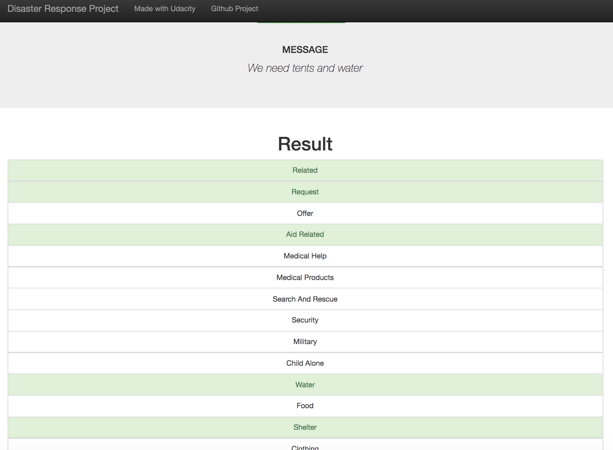

# Disaster Response Pipeline

*This project was completed to satisfy the requirements of the [Data Scientist Nanodegree](https://www.udacity.com/course/data-scientist-nanodegree--nd025) and is meant to be educational.*

## Overview

This repository hosts the pieces to spin up a Flask web app that's able to consume a message for automatic classification under one (or several)
of the 36 categories identified as helpful for aiding disaster response groups in routing the right type of assistance given the information in
the message.

Below is an example of how the website classifies the message `We need tents and water` under both the `Water` and `Shelter` categories,
amongst others available:



Under the hood, the website is powered by a Natural Language Processing Pipeline that was trained with a large collection Tweets and text messages collected and labeled by [figure-eight](https://www.figure-eight.com/).


## What's on this repository?

- [init_workspace.sh](init_workspace.sh): Helper script that initializes a conda environment with dependencies.
- [data/process_data.py](data/process_data.py): Reads both [data/disaster_categories.csv](data/disaster_categories.csv) and
[data/disaster_messages.csv](data/disaster_messages.csv) for transformation and stores the result into a SQLite database.
- [models/train_classifier.py](models/train_classifier.py): Implements a Natural Language Processing Pipeline that tokenizes, lemmatize and
vectorizes words in the pre-processed dataset so they can be used for training and evaluation of a RandomForest classifier.
- [app/run.py](app/run.py): Main entry point for the Flask web app that displays an input for users to provide a message for classification.

## Initial Setup

### Installing Dependencies

You can find all the Python dependencies in the `requirements.txt` file. It is recommended to use a `conda` managed environment.

Running the following command will set up a `conda` environment automatically, assuming `conda` is installed
([instructions](https://docs.conda.io/projects/conda/en/latest/user-guide/install/index.html)).

```bash
. init_workspace.sh
```

### Run Web App

1. Run the following commands in the project's root directory to set up your database and model.

    - To run ETL pipeline that cleans data and stores in database
        `python data/process_data.py data/disaster_messages.csv data/disaster_categories.csv data/DisasterResponse.db`
    - To run ML pipeline that trains classifier and saves (on 2015 MacBook Pro, this took 30mins and slowed down the system quite a bit)
        `python models/train_classifier.py data/DisasterResponse.db models/classifier.pkl`

2. Run the following command in the app's directory to run your web app.
    `python run.py`

3. Go to http://0.0.0.0:3001/

## License

This project is licensed under the MIT License - see the [LICENSE](LICENSE) file for details
